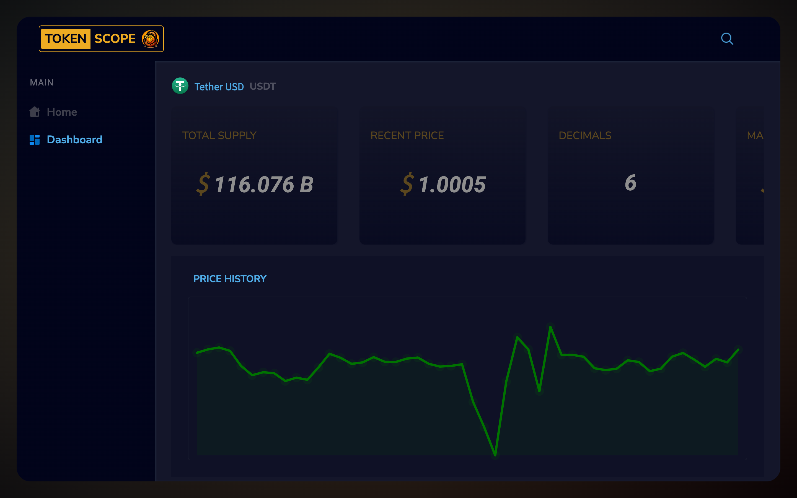

# TokenScope

### Description

TokeScope is a DApp that allows user to unmask key metrics, top holders, and insightful data on-chain - all in one place.

### Table of Contents

- [Description](#description)
- [Getting Started](#getting-started)
- [Inside the DApp](#inside-the-dapp)
- [Powered by](#powered-by)

## Getting Started

First, run the development server:

```bash
npm run dev
# or
yarn dev
# or
pnpm dev
# or
bun dev
```

Open [http://localhost:3000](http://localhost:3000) with your browser to see the result.

You can start editing the page by modifying `app/page.tsx`. The page auto-updates as you edit the file.

This project uses [`next/font`](https://nextjs.org/docs/basic-features/font-optimization) to automatically optimize and load Inter, a custom Google Font.

## Inside the DApp

<div align="center">
    
    
</div>

## Powered by

- [Next.js Documentation](https://nextjs.org/docs) - learn about Next.js features and API.
- [QuickNode Documentation](https://www.quicknode.com/docs/welcome) - learn about QuickNode's features and APIs.
- [OKLink Documentation](https://www.oklink.com/docs/en/#introduction) - dive deep into the various APIs about time based statistics of the blockchain
